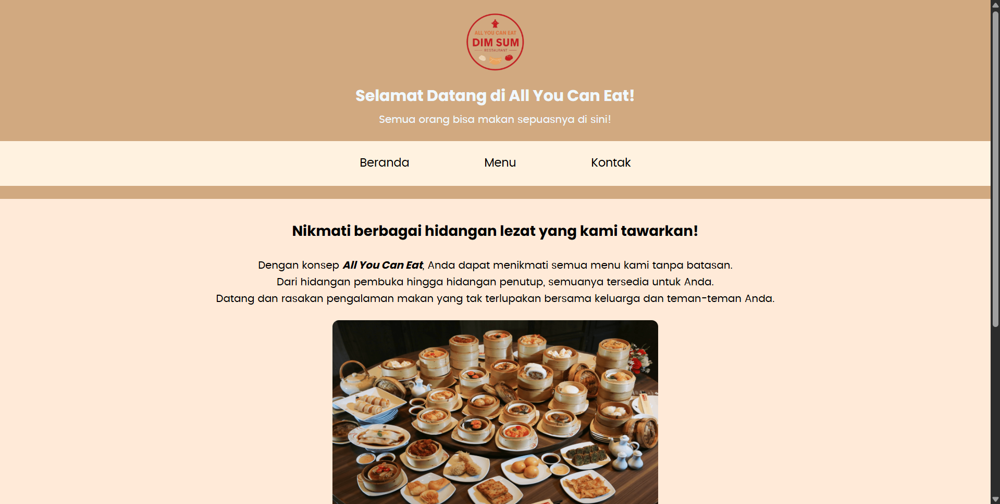
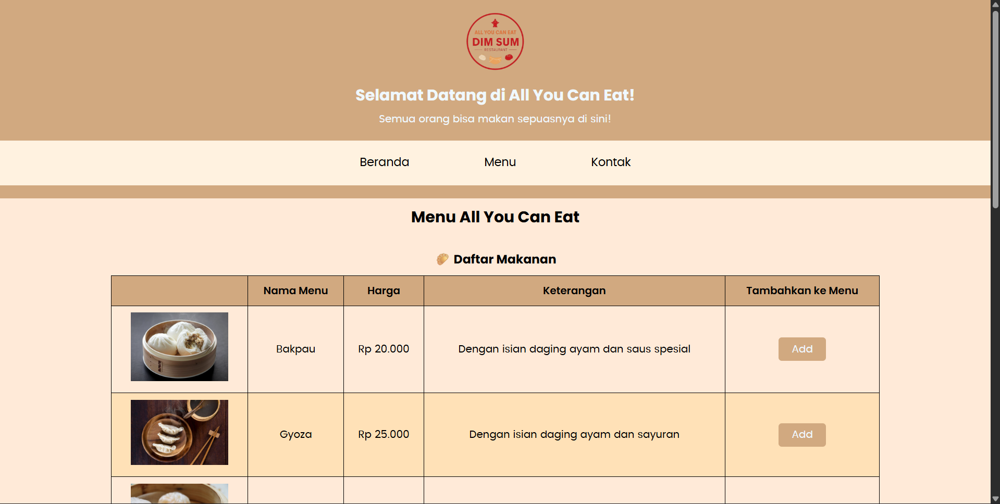
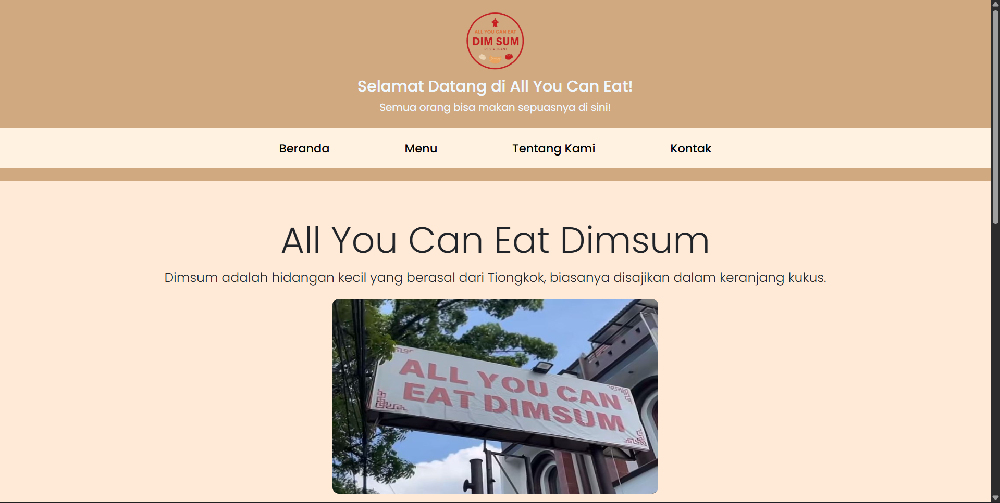

# Bootstrap Web Restaurant — All You Can Eat

Situs statis sederhana demo restoran "All You Can Eat" menggunakan HTML, CSS, dan Bootstrap CDN.

Repositori ini berisi contoh halaman multi-halaman (Beranda, Menu, Tentang Kami, Kontak) yang dibuat untuk latihan pengembangan web.

## Fitur utama

- Layout sederhana multi-halaman: `index.html`, `menu.html`, `about-us.html`, `kontak.html`.
- Menggunakan Bootstrap (CDN) untuk komponen JS (carousel) dan utilities.
- CSS kustom di `style.css` untuk tema warna, responsif, dan override beberapa gaya Bootstrap.
- Carousel gambar responsif dengan kontrol prev/next berwarna hitam dan caption.
- Navbar dengan hover effect yang diatur melalui `style.css` agar konsisten dengan tema.

## Struktur proyek

Root:

- `index.html` — Halaman beranda (welcome section, jam operasional, kontak singkat).
- `menu.html` — Daftar menu makanan & minuman dalam tabel dengan gambar dan tombol.
- `about-us.html` — Halaman tentang kami, carousel cabang, dan kontak lebih lengkap.
- `kontak.html` — Formulir kontak sederhana untuk mengirim pesan.
- `style.css` — Semua gaya kustom (tema warna, responsive rules, carousel, navbar overrides).
- `images/` — Folder gambar (logo, makanan, carousel, dsb.).
- `README.md` — (file ini) penjelasan proyek.

## Dependensi (CDN)

- Bootstrap CSS & JS: digunakan untuk grid, navbar (collapse), dan carousel.
- Bootstrap Icons (digunakan di `about-us.html` untuk ikon kontak).
- Google Fonts (Poppins) untuk tipografi.

Semua dependensi disertakan via CDN langsung di HTML, jadi tidak perlu instalasi paket.

## Perubahan penting & catatan implementasi

- Navbar hover: `style.css` menimpa gaya `.nav-link` Bootstrap dengan selektor yang lebih spesifik sehingga hover menampilkan warna teks dan latar tema.
- Carousel:
  - Gambar memakai kelas `.carousel-img` untuk membuatnya medium-size, responsif, dan menjaga rasio via `object-fit: cover`.
  - Kontrol prev/next ikon di-override menggunakan data-URI SVG berwarna hitam agar terlihat di gambar terang.
  - Caption dioptimalkan untuk readability pada berbagai ukuran layar.
- Responsiveness: added media queries di `style.css` (breakpoints 992px, 768px, 576px, 480px) untuk menyesuaikan header, navbar, kolom konten (stack pada mobile), form input, dan carousel height.

## Cara menjalankan lokal

Pilihan cepat: buka file HTML langsung di browser (double-click `index.html` atau `about-us.html`).

Pilihan server sederhana (rekomendasi untuk menghindari masalah path atau CORS saat menguji beberapa file):

1. Menggunakan Python 3 (Linux/macOS/Windows dengan WSL atau Git Bash):

```bash
# di folder proyek
python -m http.server 8000
# buka http://localhost:8000 di browser
```

2. Menggunakan Live Server extension di VS Code (jika tersedia): klik kanan `index.html` -> Open with Live Server.

## Cara mengecek perubahan yang dibuat

- Navbar hover: arahkan mouse ke link navbar dan lihat warna dan latar berubah.
- Carousel: buka `about-us.html`, lihat carousel pada berbagai lebar viewport. Kontrol prev/next sekarang berwarna hitam.
- Responsiveness: gunakan DevTools (Ctrl+Shift+I) -> Toggle device toolbar (Ctrl+Shift+M) dan ubah ukuran layar.

## Hasil Screenshot
- Halaman Beranda

<br>

- Halaman Menu

<br>

- Halaman Tentang Kami
